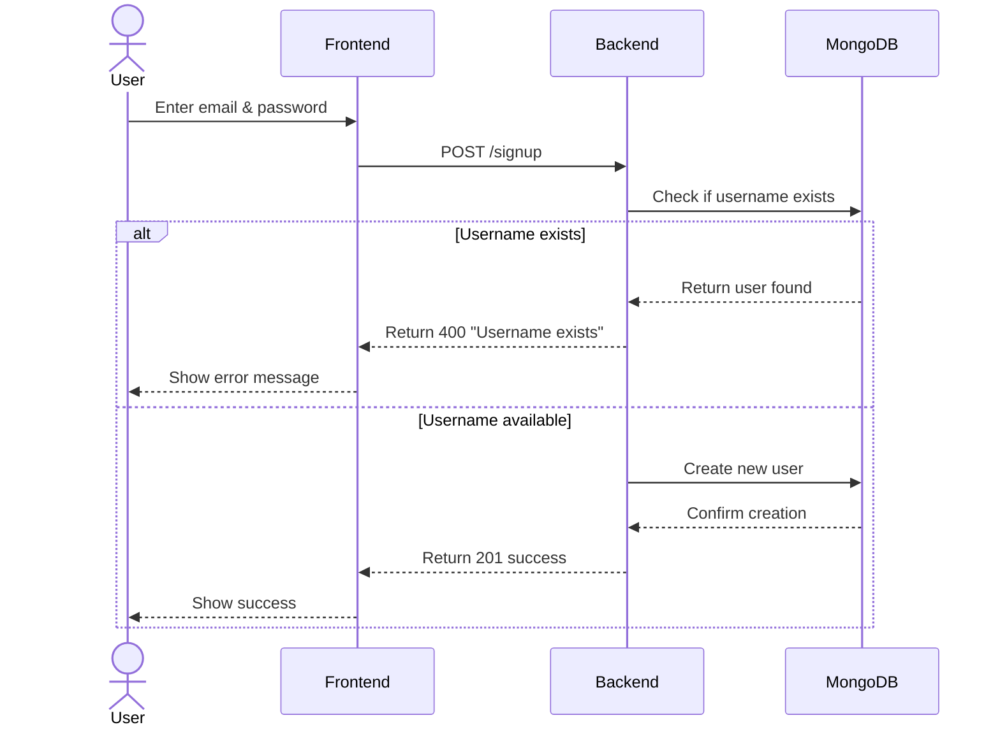
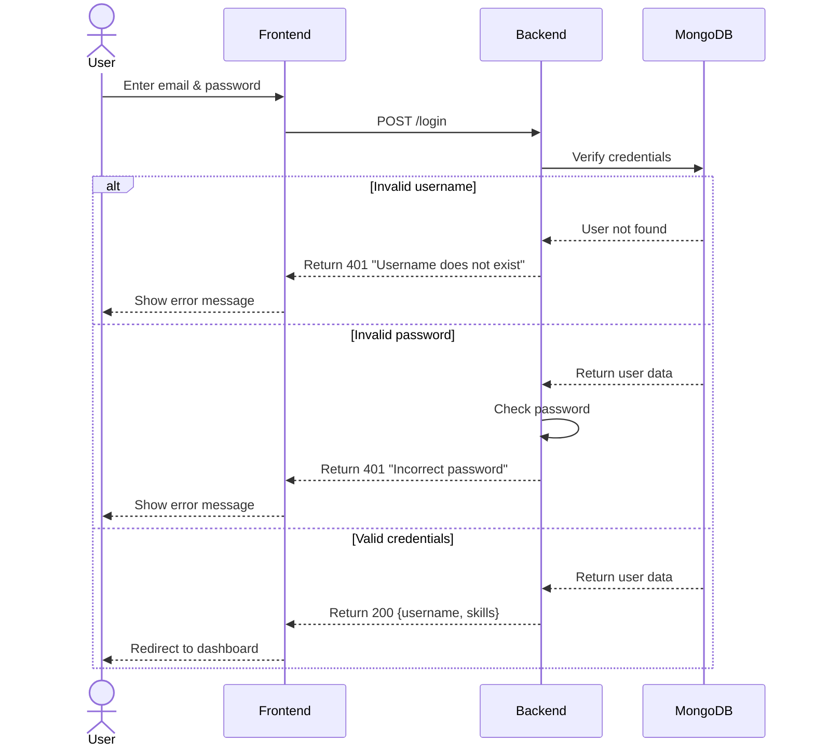
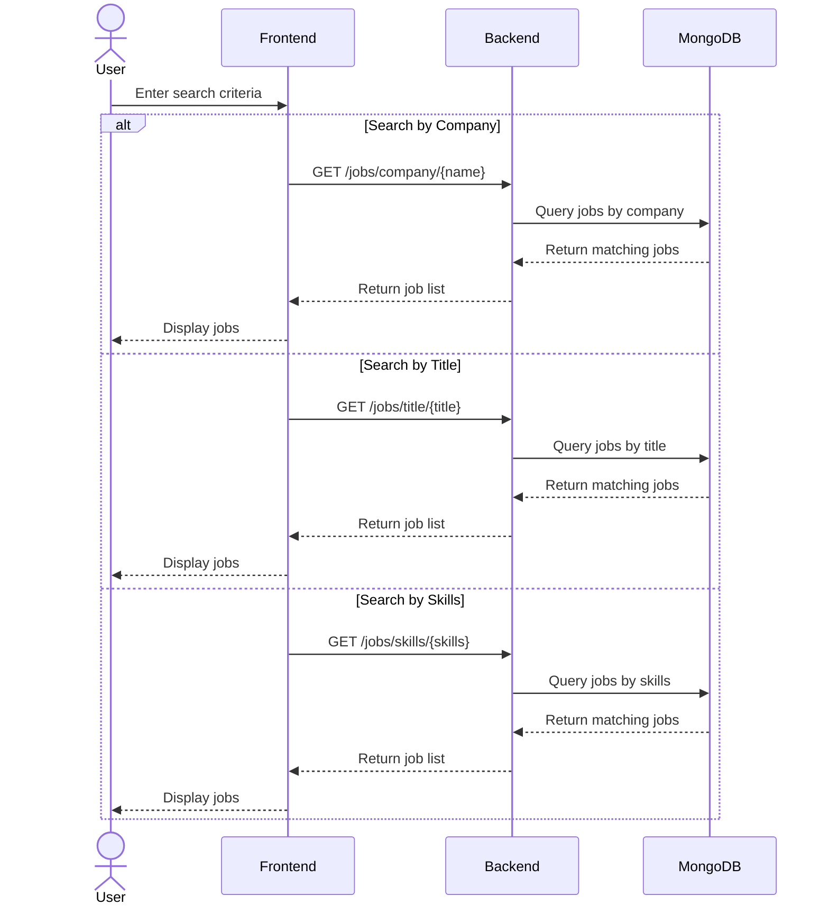
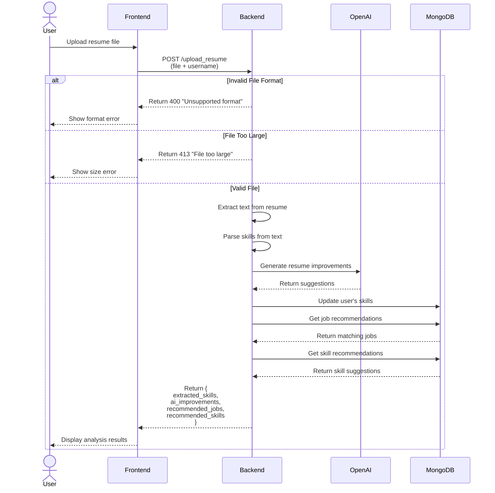
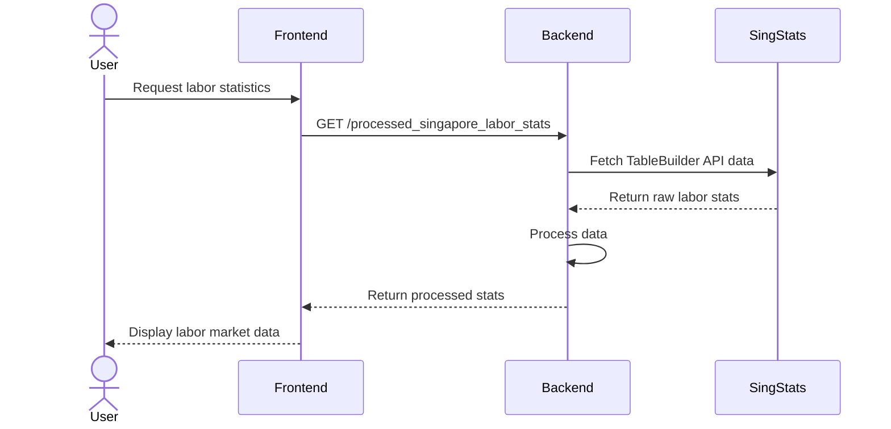
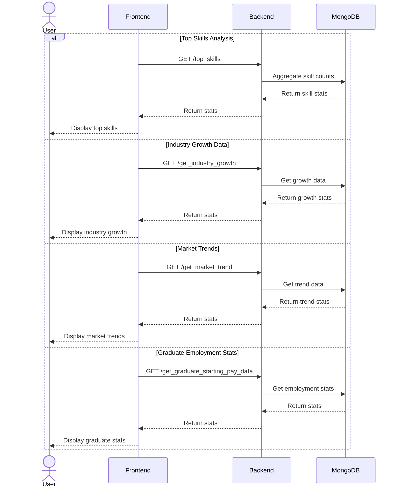

Signup

```mermaid
sequenceDiagram
    actor User
    participant Frontend
    participant Backend
    participant MongoDB

    User->>Frontend: Enter email & password
    Frontend->>Backend: POST /signup
    Backend->>MongoDB: Check if username exists

    alt Username exists
        MongoDB-->>Backend: Return user found
        Backend-->>Frontend: Return 400 "Username exists"
        Frontend-->>User: Show error message
    else Username available
        Backend->>MongoDB: Create new user
        MongoDB-->>Backend: Confirm creation
        Backend-->>Frontend: Return 201 success
        Frontend-->>User: Show success
    end
```

Login

```mermaid
sequenceDiagram
    actor User
    participant Frontend
    participant Backend
    participant MongoDB

    User->>Frontend: Enter email & password
    Frontend->>Backend: POST /login
    Backend->>MongoDB: Verify credentials

    alt Invalid username
        MongoDB-->>Backend: User not found
        Backend-->>Frontend: Return 401 "Username does not exist"
        Frontend-->>User: Show error message
    else Invalid password
        MongoDB-->>Backend: Return user data
        Backend->>Backend: Check password
        Backend-->>Frontend: Return 401 "Incorrect password"
        Frontend-->>User: Show error message
    else Valid credentials
        MongoDB-->>Backend: Return user data
        Backend-->>Frontend: Return 200 {username, skills}
        Frontend-->>User: Redirect to dashboard
    end
```

Search Feature

```mermaid
sequenceDiagram
    actor User
    participant Frontend
    participant Backend
    participant MongoDB

    User->>Frontend: Enter search criteria

    alt Search by Company
        Frontend->>Backend: GET /jobs/company/{name}
        Backend->>MongoDB: Query jobs by company
        MongoDB-->>Backend: Return matching jobs
        Backend-->>Frontend: Return job list
        Frontend-->>User: Display jobs

    else Search by Title
        Frontend->>Backend: GET /jobs/title/{title}
        Backend->>MongoDB: Query jobs by title
        MongoDB-->>Backend: Return matching jobs
        Backend-->>Frontend: Return job list
        Frontend-->>User: Display jobs

    else Search by Skills
        Frontend->>Backend: GET /jobs/skills/{skills}
        Backend->>MongoDB: Query jobs by skills
        MongoDB-->>Backend: Return matching jobs
        Backend-->>Frontend: Return job list
        Frontend-->>User: Display jobs
    end
```

Upload Resume

```mermaid
sequenceDiagram
    actor User
    participant Frontend
    participant Backend
    participant OpenAI
    participant MongoDB

    User->>Frontend: Upload resume file
    Frontend->>Backend: POST /upload_resume<br>(file + username)

    alt Invalid File Format
        Backend-->>Frontend: Return 400 "Unsupported format"
        Frontend-->>User: Show format error
    else File Too Large
        Backend-->>Frontend: Return 413 "File too large"
        Frontend-->>User: Show size error
    else Valid File
        Backend->>Backend: Extract text from resume
        Backend->>Backend: Parse skills from text
        Backend->>OpenAI: Generate resume improvements
        OpenAI-->>Backend: Return suggestions
                Backend->>MongoDB: Update user's skills

        Backend->>MongoDB: Get job recommendations
        MongoDB-->>Backend: Return matching jobs
        Backend->>MongoDB: Get skill recommendations
        MongoDB-->>Backend: Return skill suggestions

        Backend-->>Frontend: Return {<br>extracted_skills,<br>ai_improvements,<br>recommended_jobs,<br>recommended_skills<br>}
        Frontend-->>User: Display analysis results
    end
```

SingStat API Call

```mermaid
sequenceDiagram
    actor User
    participant Frontend
    participant Backend
    participant SingStats

    User->>Frontend: Request labor statistics
    Frontend->>Backend: GET /processed_singapore_labor_stats
    Backend->>SingStats: Fetch TableBuilder API data
    SingStats-->>Backend: Return raw labor stats
    Backend->>Backend: Process data
    Backend-->>Frontend: Return processed stats
    Frontend-->>User: Display labor market data
```

Other Chart Data

```mermaid
sequenceDiagram
    actor User
    participant Frontend
    participant Backend
    participant MongoDB

    alt Top Skills Analysis
        Frontend->>Backend: GET /top_skills
        Backend->>MongoDB: Aggregate skill counts
        MongoDB-->>Backend: Return skill stats
        Backend-->>Frontend: Return stats
        Frontend-->>User: Display top skills

    else Industry Growth Data
        Frontend->>Backend: GET /get_industry_growth
        Backend->>MongoDB: Get growth data
        MongoDB-->>Backend: Return growth stats
        Backend-->>Frontend: Return stats
        Frontend-->>User: Display industry growth

    else Market Trends
        Frontend->>Backend: GET /get_market_trend
        Backend->>MongoDB: Get trend data
        MongoDB-->>Backend: Return trend stats
        Backend-->>Frontend: Return stats
        Frontend-->>User: Display market trends

    else Graduate Employment Stats
        Frontend->>Backend: GET /get_graduate_starting_pay_data
        Backend->>MongoDB: Get employment stats
        MongoDB-->>Backend: Return stats
        Backend-->>Frontend: Return stats
        Frontend-->>User: Display graduate stats
    end
```
